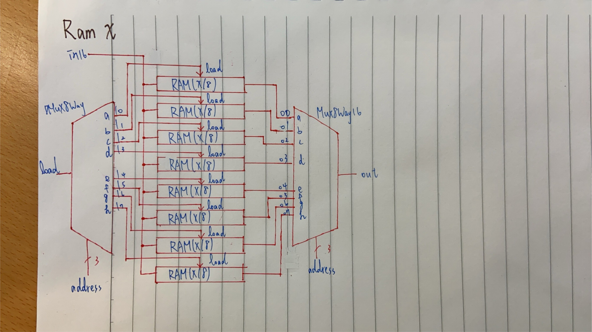

# Homework WEEK7

</img>

* 由於RAM規則都相似，所以我整理在同一張圖內
## 1.RAM8

* CODE

<pre><code>// This file is part of www.nand2tetris.org
// and the book "The Elements of Computing Systems"
// by Nisan and Schocken, MIT Press.
// File name: projects/03/a/RAM8.hdl

/**
 * Memory of 8 registers, each 16 bit-wide. Out holds the value
 * stored at the memory location specified by address. If load==1, then 
 * the in value is loaded into the memory location specified by address 
 * (the loaded value will be emitted to out from the next time step onward).
 */

CHIP RAM8 {
    IN in[16], load, address[3];
    OUT out[16];

    PARTS:
    // Put your code here:
    DMux8Way(in=load , sel=address , a=l0 , b=l1 , c=l2 , d=l3 , e=l4 , f=l5 , g=l6 , h=l7);
    Register(in=in , load=l0 , out=o0);
    Register(in=in , load=l1 , out=o1);
    Register(in=in , load=l2 , out=o2);
    Register(in=in , load=l3 , out=o3);
    Register(in=in , load=l4 , out=o4);
    Register(in=in , load=l5 , out=o5);
    Register(in=in , load=l6 , out=o6);
    Register(in=in , load=l7 , out=o7);
    Mux8Way16(a=o0 , b=o1 , c=o2 , d=o3 , e=o4 , f=o5 , g=o6 , h=o7 , sel=address , out=out);
}</code></pre>

* RAM8由8個Register組成，由DMux8Way控制In寫入的Register位置(DMux8Way的sel為3bit的address)

## 2.RAM64

* CODE

<pre><code>// This file is part of www.nand2tetris.org
// and the book "The Elements of Computing Systems"
// by Nisan and Schocken, MIT Press.
// File name: projects/03/a/RAM64.hdl

/**
 * Memory of 64 registers, each 16 bit-wide. Out holds the value
 * stored at the memory location specified by address. If load==1, then 
 * the in value is loaded into the memory location specified by address 
 * (the loaded value will be emitted to out from the next time step onward).
 */

CHIP RAM64 {
    IN in[16], load, address[6];
    OUT out[16];

    PARTS:
    // Put your code here:
    DMux8Way(in=load , sel=address[3..5] , a=l0 , b=l1 , c=l2 , d=l3 , e=l4 , f=l5 , g=l6 , h=l7);
    RAM8(in=in , load=l0 , address=address[0..2] , out=o0);
    RAM8(in=in , load=l1 , address=address[0..2] , out=o1);
    RAM8(in=in , load=l2 , address=address[0..2] , out=o2);
    RAM8(in=in , load=l3 , address=address[0..2] , out=o3);
    RAM8(in=in , load=l4 , address=address[0..2] , out=o4);
    RAM8(in=in , load=l5 , address=address[0..2] , out=o5);
    RAM8(in=in , load=l6 , address=address[0..2] , out=o6);
    RAM8(in=in , load=l7 , address=address[0..2] , out=o7);
    Mux8Way16(a=o0 , b=o1 , c=o2 , d=o3 , e=o4 , f=o5 , g=o6 , h=o7 , sel=address[3..5] , out=out);
}</code></pre>

* RAM64的原理與RAM8相同，將Register改成8個RAM8，以及address改成6bits

## 3.RAM512

* CODE

<pre><code>// This file is part of the materials accompanying the book 
// "The Elements of Computing Systems" by Nisan and Schocken, 
// MIT Press. Book site: www.idc.ac.il/tecs
// File name: projects/03/b/RAM512.hdl

/**
 * Memory of 512 registers, each 16 bit-wide. Out holds the value
 * stored at the memory location specified by address. If load==1, then 
 * the in value is loaded into the memory location specified by address 
 * (the loaded value will be emitted to out from the next time step onward).
 */

CHIP RAM512 {
    IN in[16], load, address[9];
    OUT out[16];

    PARTS:
    // Put your code here:
    DMux8Way(in=load , sel=address[6..8] , a=l0 , b=l1 , c=l2 , d=l3 , e=l4 , f=l5 , g=l6 , h=l7);
    RAM64(in=in , load=l0 , address=address[0..5] , out=o0);
    RAM64(in=in , load=l1 , address=address[0..5] , out=o1);
    RAM64(in=in , load=l2 , address=address[0..5] , out=o2);
    RAM64(in=in , load=l3 , address=address[0..5] , out=o3);
    RAM64(in=in , load=l4 , address=address[0..5] , out=o4);
    RAM64(in=in , load=l5 , address=address[0..5] , out=o5);
    RAM64(in=in , load=l6 , address=address[0..5] , out=o6);
    RAM64(in=in , load=l7 , address=address[0..5] , out=o7);
    Mux8Way16(a=o0 , b=o1 , c=o2 , d=o3 , e=o4 , f=o5 , g=o6 , h=o7 , sel=address[6..8] , out=out);
}</code></pre>

* 原理同上，8個RAM64組成，address共9bits

## 4.RAM4K

* CODE

<pre><code>// This file is part of www.nand2tetris.org
// and the book "The Elements of Computing Systems"
// by Nisan and Schocken, MIT Press.
// File name: projects/03/b/RAM4K.hdl

/**
 * Memory of 4K registers, each 16 bit-wide. Out holds the value
 * stored at the memory location specified by address. If load==1, then 
 * the in value is loaded into the memory location specified by address 
 * (the loaded value will be emitted to out from the next time step onward).
 */

CHIP RAM4K {
    IN in[16], load, address[12];
    OUT out[16];

    PARTS:
    // Put your code here:
    DMux8Way(in=load , sel=address[9..11] , a=l0 , b=l1 , c=l2 , d=l3 , e=l4 , f=l5 , g=l6 , h=l7);
    RAM512(in=in , load=l0 , address=address[0..8] , out=o0);
    RAM512(in=in , load=l1 , address=address[0..8] , out=o1);
    RAM512(in=in , load=l2 , address=address[0..8] , out=o2);
    RAM512(in=in , load=l3 , address=address[0..8] , out=o3);
    RAM512(in=in , load=l4 , address=address[0..8] , out=o4);
    RAM512(in=in , load=l5 , address=address[0..8] , out=o5);
    RAM512(in=in , load=l6 , address=address[0..8] , out=o6);
    RAM512(in=in , load=l7 , address=address[0..8] , out=o7);
    Mux8Way16(a=o0 , b=o1 , c=o2 , d=o3 , e=o4 , f=o5 , g=o6 , h=o7 , sel=address[9..11] , out=out);
}</code></pre>

* 原理同上，8個RAM512組成，address共12bits

## 5.RAM16K

* CODE

<pre><code>// This file is part of www.nand2tetris.org
// and the book "The Elements of Computing Systems"
// by Nisan and Schocken, MIT Press.
// File name: projects/03/b/RAM16K.hdl

/**
 * Memory of 16K registers, each 16 bit-wide. Out holds the value
 * stored at the memory location specified by address. If load==1, then 
 * the in value is loaded into the memory location specified by address 
 * (the loaded value will be emitted to out from the next time step onward).
 */

CHIP RAM16K {
    IN in[16], load, address[14];
    OUT out[16];

    PARTS:
    // Put your code here:
    DMux4Way(in=load , sel=address[12..13] , a=l0 , b=l1 , c=l2 , d=l3);
    RAM4K(in=in , load=l0 , address=address[0..11] , out=o0);
    RAM4K(in=in , load=l1 , address=address[0..11] , out=o1);
    RAM4K(in=in , load=l2 , address=address[0..11] , out=o2);
    RAM4K(in=in , load=l3 , address=address[0..11] , out=o3);
    Mux4Way16(a=o0 , b=o1 , c=o2 , d=o3 , sel=address[12..13] , out=out);
}</code></pre>

* 原理同上，但由4個RAM4K組成，控制寫入改為DMux4Way，address共14bits

## 本週心得
* 這週的習題原理都相同，能夠寫出RAM8後面的習題就不是問題，就只是組成的單元稍有不同，以及address的第幾個bit需要注意而已!!