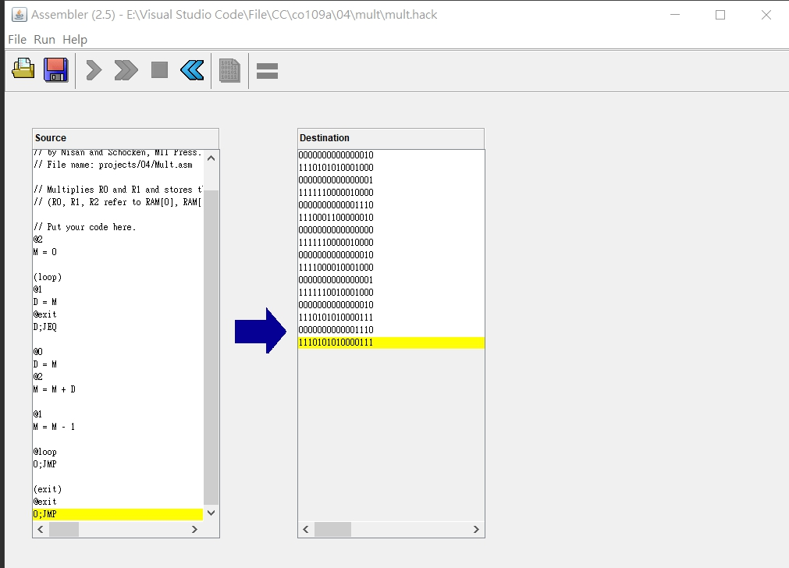
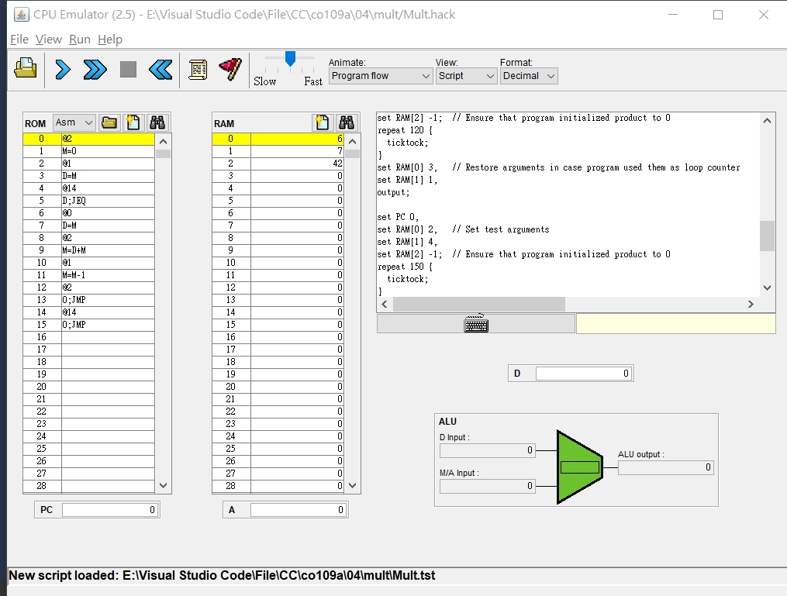
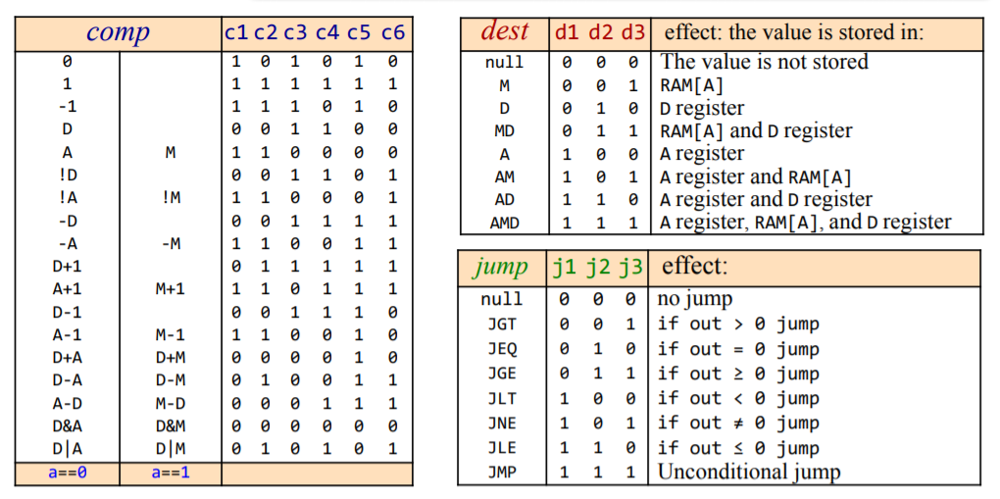

# Homework WEEK9

## mult

* CODE

<pre><code>// This file is part of www.nand2tetris.org
// and the book "The Elements of Computing Systems"
// by Nisan and Schocken, MIT Press.
// File name: projects/04/Mult.asm

// Multiplies R0 and R1 and stores the result in R2.
// (R0, R1, R2 refer to RAM[0], RAM[1], and RAM[2], respectively.)

// Put your code here.

// R0 加上 R1 次後存入 R2

@2  
M = 0   // R2設為0

(loop)
@1
D = M   //將R1存入暫存器
@exit
D;JEQ   //若R1為0 JUMP TO @exit

@0
D = M   // 將R0存入暫存器
@2
M = M + D   // R2 = R2 + R0

@1
M = M - 1   // R1 - 1

@loop
0;JMP // JUMP to loop

(exit)
@exit
0;JMP</code></pre>

* 轉為機械碼

</img>

* 程式執行

</img>

## 本週心得
* 這周遇到了一點障礙，語法不習慣導致沒有辦法順利地寫出程式。
* 參考網址:https://github.com/FUYUHSUAN/co109a/blob/master/homework/HW8(9week).md

## 語法筆記
* "@"為指定記憶體位置
* M為指定記憶體中的值
* D為暫存器
* 存下指令圖備用，這樣較方便查詢
</img>